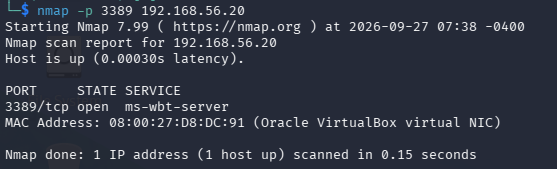
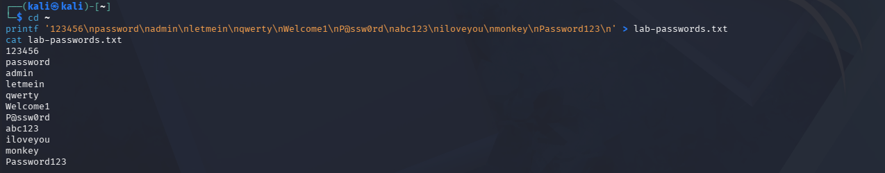
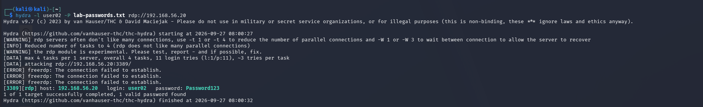
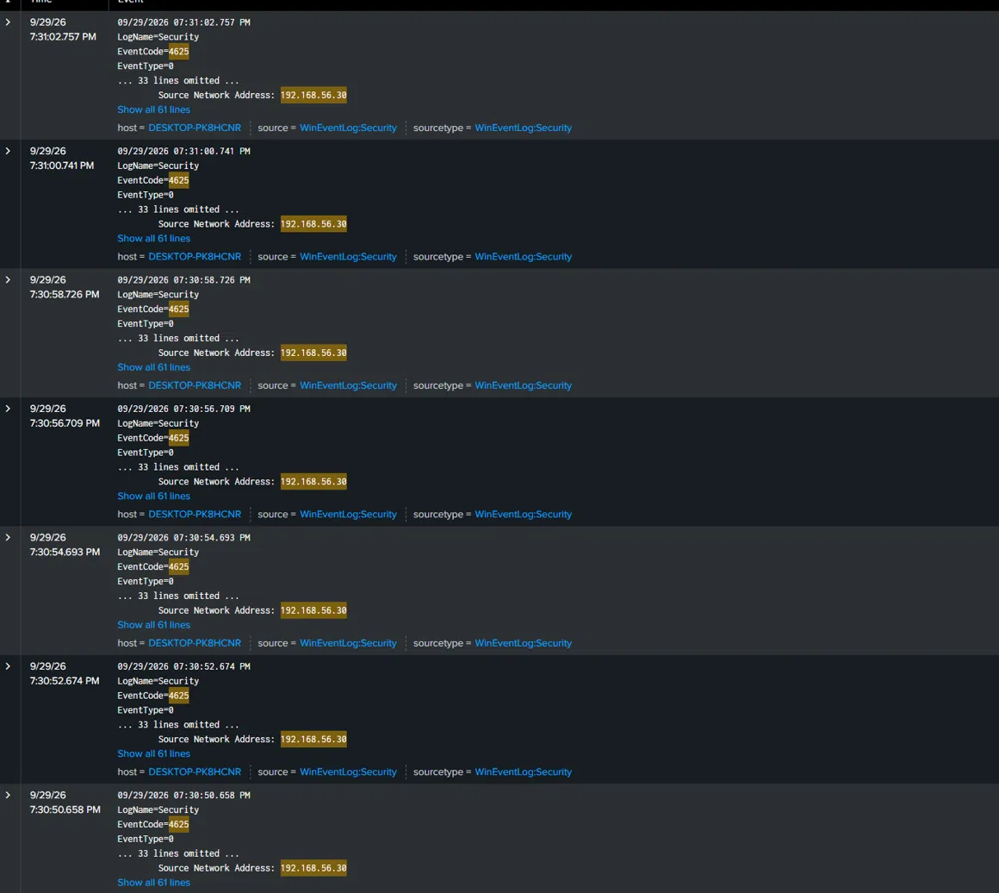
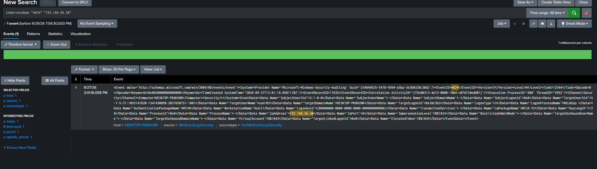
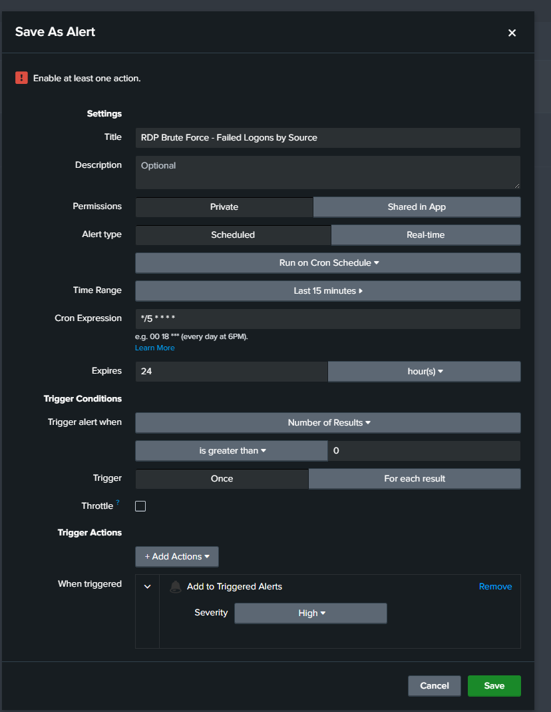
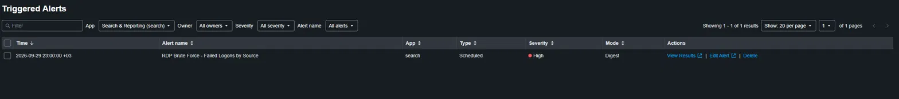

# Detection 1 — RDP Brute Force

**MITRE ATT&CK:** T1110 (Brute Force)
**Log source:** Windows Security log — Event 4625 (failed logon), Event 4624 (successful logon)

## The attack

From Kali (192.168.56.30), I scanned the victim (192.168.56.20) using nmap and confirmed RDP was exposed on port 3389.



I used an 11-password list with the real password last, so the attack ends in a successful login.



After that I ran Hydra against the victim's RDP service:

```
hydra -l user02 -P lab-passwords.txt rdp://192.168.56.20
```

Hydra cracked the account:

```
[3389][rdp] host: 192.168.56.20  login: user02  password: Password123
```



## Log source

Every failed login writes Event 4625 to the Security log, and every successful login writes Event 4624. These two events are the evidence this detection is built on.

## The query

The detection counts failed logons per source IP and flags any source above a threshold. It does not assume the attacker's IP — the attacker is whatever source crosses the threshold.

```
index=windows source="WinEventLog:Security" EventCode=4625
| stats count by Source_Network_Address
| where count > 10
```

Result: `192.168.56.30 → 37`



## Did they get in?

Checking for a successful logon (4624) from the same source:

```
index=windows EventCode=4624 Source_Network_Address="192.168.56.30"
```

Result: 1 success against user02. This shows it is a breach, not just an attempt.



## Event volume

- Total 4625 (failed logins) from 192.168.56.30 was 37 across all attack runs.
- A single run was ~14 failures.
- 4624 (successful logon) from the attacker was 1.

## The alert

The query is saved as a scheduled Splunk alert:
- Runs every 5 minutes, searching the last 15 minutes
- Triggers when the query returns a result, which means a source has met the condition
- Severity: High



Confirmed firing automatically after a live attack — the detection catches the attack on its own, not just when run by hand.



## False positives

Normal activity also creates 4625 events, like a user who forgot their password and retries a few times. But that does not produce ~37 failures from one source in seconds, so the `count > 10` threshold separates a real user's mistakes from an automated attack. To tune further, I could add a time constraint so only bursts of failures in a short window count.

**Limitation:** this catches classic brute force — many failures against one account from one source. It would miss password spraying, where one password is tried against many accounts, because that keeps failures-per-account low. That needs a different detection grouping by source across many users.

## Response steps

When this fires:
1. Note the source IP and the targeted account.
2. Check for a 4624 success from that source after the failures — did any guess work?
3. If yes: treat as a breach. Reset the account, isolate the host, check what the session did.
4. If no: confirm the source is blocked, and check whether the account should have been reachable by RDP at all.
5. Check if the same source hit other accounts or hosts.

## Hardening note

The victim had no account lockout policy (threshold = 0), which allowed unlimited guesses. A lockout threshold would stop this brute force.

## NCA ECC-2:2024 mapping

- **2-12 Cybersecurity Event Logs and Monitoring Management** — logon events are collected centrally and monitored, which is what makes this detection possible.
- **2-13 Cybersecurity Incident and Threat Management** — the triage steps show how a detected event moves to response.
