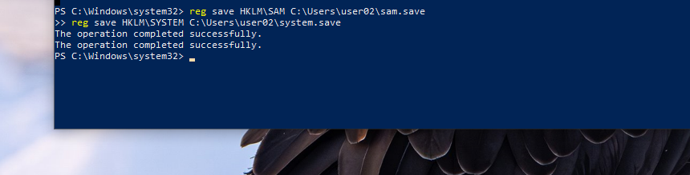
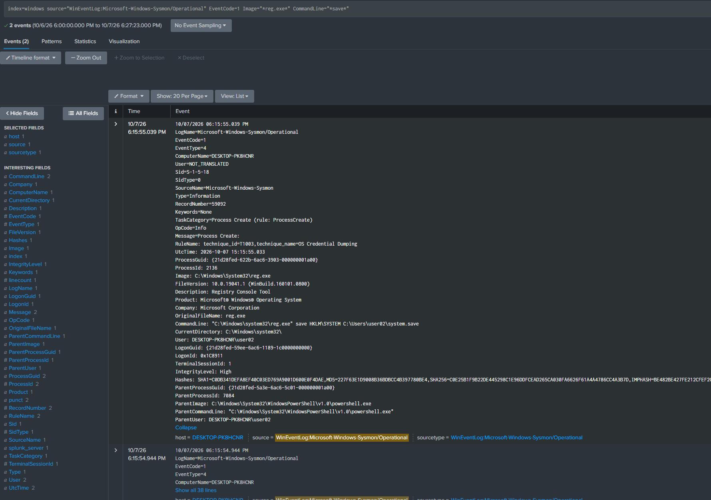
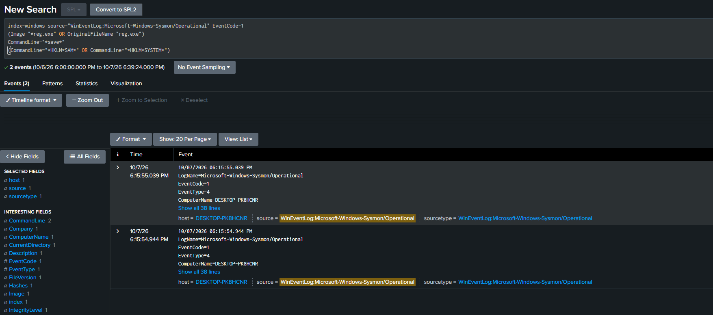
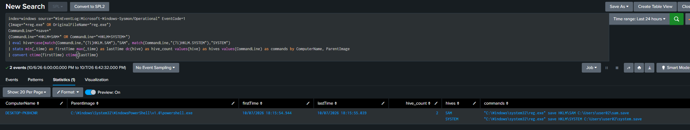
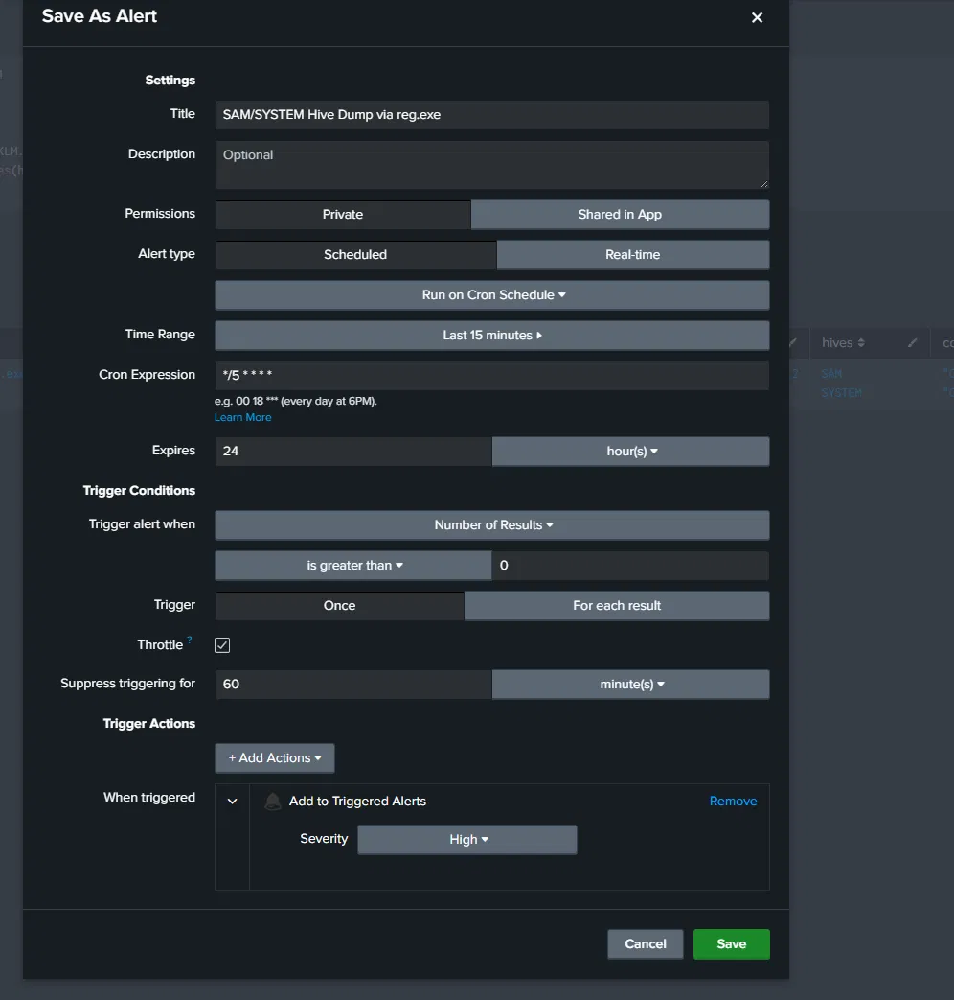
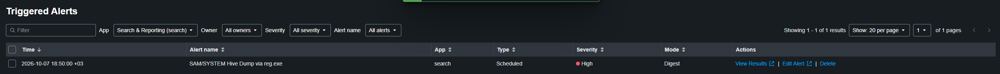

# Detection 4 — SAM Hive Dump via reg.exe

**MITRE ATT&CK:** T1003.002 (OS Credential Dumping: Security Account Manager)
**Log source:** Sysmon Event 1 (process creation)

## The attack

The SAM registry hive (`HKLM\SAM`) holds the password hashes of every local account on the machine. Those hashes are encrypted, and the key to decrypt them lives in a second hive, SYSTEM (`HKLM\SYSTEM`). So an attacker needs both — the hashes and the key — which is why the attack is two commands, not one.

`reg save` is the built-in Windows tool that copies a registry hive to a file. From the victim (192.168.56.20), as the local admin account `user02`, I saved both hives to disk. The attacker's next move would be to pull these files off the machine and crack or pass the hashes offline, away from the victim and its monitoring. `reg.exe` is a signed, trusted Windows binary, so nothing foreign ever touches the machine — this is living off the land.

```
reg save HKLM\SAM C:\Users\user02\sam.save
reg save HKLM\SYSTEM C:\Users\user02\system.save
```



Dumping `HKLM\SAM` requires administrator rights — the hive is locked by an ACL to SYSTEM and Administrators, so a normal user cannot read it. `user02` is a local admin, confirmed by `IntegrityLevel: High` on the event.

## Log source

`reg.exe` running is a process creation, so it lands as **Sysmon Event 1**, which carries the full command line. That one field is the whole detection — it shows the tool (`reg.exe`), the action (`save`), and the target hive (`HKLM\SAM` / `HKLM\SYSTEM`).

```
index=windows source="WinEventLog:Microsoft-Windows-Sysmon/Operational" EventCode=1 Image="*reg.exe" CommandLine="*save*"
```

The fields the detection relies on, read straight off the event:

- `CommandLine` — the full `reg.exe save HKLM\SAM ...` string
- `Image` / `OriginalFileName` — the process is `reg.exe`
- `ParentImage` — what launched it (here `powershell.exe`), used in triage
- `IntegrityLevel` — `High`, which confirms the admin rights the dump needs



## The query

The detection keys on the behaviour — `reg.exe` saving a sensitive hive — never on the filename or path I chose, so it still fires when the attacker picks different ones.

```
index=windows source="WinEventLog:Microsoft-Windows-Sysmon/Operational" EventCode=1
(Image="*reg.exe" OR OriginalFileName="reg.exe")
CommandLine="*save*"
(CommandLine="*HKLM*SAM*" OR CommandLine="*HKLM*SYSTEM*")
```

Three conditions stacked:

- **`reg.exe`, checked two ways.** `Image` is the path on disk; `OriginalFileName` is the name Microsoft compiled into the file itself. Matching both means renaming `reg.exe` to something else does not evade the rule — the path changes, the file's internal name does not.
- **`save`** — a save operation, not a harmless `reg query`.
- **`HKLM\SAM` or `HKLM\SYSTEM`** — a sensitive hive. The `*` between `HKLM` and the hive name spans the backslash, which Splunk otherwise treats as an escape character. The OR is deliberate — the rule fires on either hive alone (see next section).

Result: exactly the two hive dumps, and nothing else.



## Fire on either hive, flag both

A full dump is two commands — SAM and SYSTEM — but the rule does not *require* both. If it did, an attacker who grabbed only SAM, or dumped the two hives an hour apart, would slip through. A single `reg.exe save HKLM\SAM` is already abnormal, so one hive is enough to fire.

But seeing both hives dumped close together is the worst case — the complete set needed to crack the hashes offline — so the rule surfaces it. A second stage collapses the matches into one row per host and parent process and counts how many distinct hives were taken:

```
index=windows source="WinEventLog:Microsoft-Windows-Sysmon/Operational" EventCode=1
(Image="*reg.exe" OR OriginalFileName="reg.exe")
CommandLine="*save*"
(CommandLine="*HKLM*SAM*" OR CommandLine="*HKLM*SYSTEM*")
| eval hive=case(match(CommandLine,"(?i)HKLM.SAM"),"SAM", match(CommandLine,"(?i)HKLM.SYSTEM"),"SYSTEM")
| stats min(_time) as firstTime max(_time) as lastTime dc(hive) as hive_count values(hive) as hives values(CommandLine) as commands by ComputerName, ParentImage
| convert ctime(firstTime) ctime(lastTime)
```

`eval` labels each event `SAM` or `SYSTEM`. `stats ... dc(hive)` counts distinct hives per host and parent; `hive_count = 2` means both halves were taken. It groups by `ParentImage`, not user — the same event carries two user values (the real actor and the `NOT_TRANSLATED` envelope), which would split one attack into two rows, while the parent process tells you *what* launched the dump, which is the real triage question.

Result: one row — the victim host, parent `powershell.exe`, `hive_count = 2`, `hives = SAM SYSTEM`, the two timestamps seconds apart. That single line is the whole story: this host dumped both halves of the local credential store in one second.



## Event volume

- 2 Sysmon Event 1 records — one `reg save HKLM\SAM`, one `reg save HKLM\SYSTEM`.
- The correlation collapses them into 1 row, `hive_count = 2`.

Low volume, high signal — almost nothing legitimate produces this, which is what a credential-dumping detection should look like.

## The alert

The correlated query is saved as a scheduled Splunk alert:

- Runs every 5 minutes, searching the last 15 minutes
- Window is wider than the schedule so a dump on a schedule boundary is still fully captured
- Triggers when the query returns a result — the query already decides what counts as an attack, so any row is the attack
- Throttled to one alert per host per 60 minutes, so one attack is one alert
- Severity: High — a successful hive dump means the hashes are already stolen, not an attack still in progress



Confirmed firing automatically after a live attack.



## False positives

Exporting a registry hive is normal — backups and admins do it. But backups almost never copy `SAM` or `SYSTEM` by hand with `reg.exe save`; they image the whole disk or use Volume Shadow Copy. So saving those two hives specifically is rare and suspicious, which is why the rule keys on the hive, not on registry export in general.

The few things that could trip it are an admin grabbing hives before a risky change, a forensics tool collecting them, or a migration script. Tell these apart from an attack by context, not by loosening the rule:

- **Parent process** — a backup or IR tool (benign) vs `powershell.exe`, `cmd.exe`, or an Office app (suspicious). An Office app has no reason to run `reg.exe`, so that one is malicious.
- **User** — a backup or service account (benign) vs a normal user.
- **Output path** — a backup folder (benign) vs `%Temp%` or `C:\Users\Public` (suspicious).

When something is confirmed benign, exclude it by its exact path and user — never by weakening the rule. The lab has nothing that dumps hives legitimately, so no exclusion is needed.

**Limitation:** the rule only catches `reg.exe save`. An attacker who dumps the hives another way — Volume Shadow Copy, a raw read of the file, or a different tool — would not trip it.

## Response steps

When this fires:

1. Read the alert row — the host, the parent process, the user, and the command lines showing which hives were dumped (`SAM`, `SYSTEM`, or both) and where they were saved.
2. Check the context. Parent process is the fastest tell: `powershell.exe` or `cmd.exe` means a person or script at a shell, so keep checking; an Office app like `winword.exe` means a document launched it, which is malicious. Then check the user, and whether the output path is somewhere odd like `%Temp%` or `C:\Users\Public`.
3. Decide how bad it is. Both `SAM` and `SYSTEM` dumped close together is the worst case — the full set needed to crack the hashes offline. One hive alone is still an attack, but the pair means they have everything.
4. Contain. The hashes are copied to disk the moment `reg save` succeeds, so killing the process is not enough — the theft already happened. Isolate the host, then treat every local account on it as compromised: reset the local passwords, especially the built-in Administrator, and rotate that password anywhere it is reused on other machines. Seize or delete the `.save` files.
5. Check scope. Did the same pattern fire on other hosts? And because the stolen hashes enable pass-the-hash, check whether the local admin account is now authenticating on machines it has no reason to touch.

## Hardening note

The best fix is to make a stolen SAM hive worthless. Its value comes from the local Administrator password being reused across many machines — crack it once, unlock them all. Give each machine a unique local admin password (for example with Microsoft LAPS), and a stolen hive only unlocks the one box it came from. Limiting who has local admin also helps, since the dump needs admin rights.

## NCA ECC-2:2024 mapping

- **2-12 Cybersecurity Event Logs and Monitoring Management** — centrally collected Sysmon logs, continuously monitored, are what make this detection possible.
- **2-13 Cybersecurity Incident and Threat Management** — the response steps show how a detected event moves into response.
- **2-3 Information System and Information Processing Facilities Protection** — the detection protects the endpoint against credential theft, supporting the control's protection intent.
