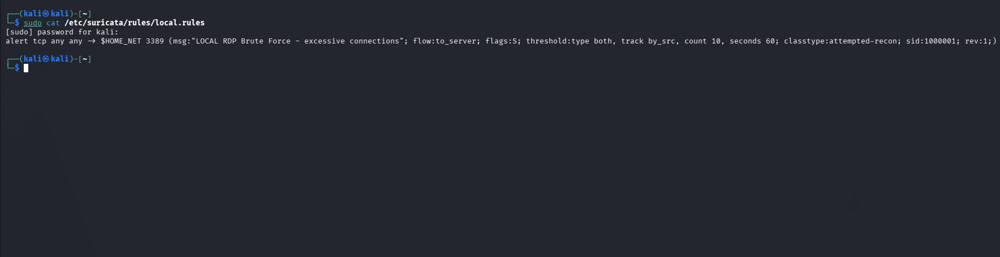
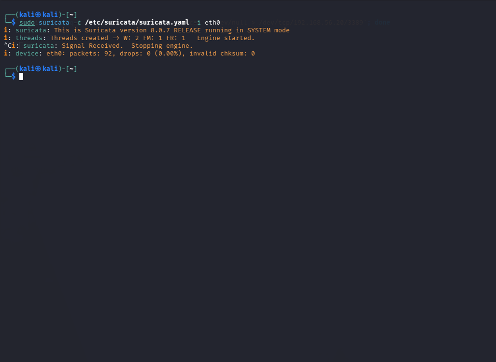
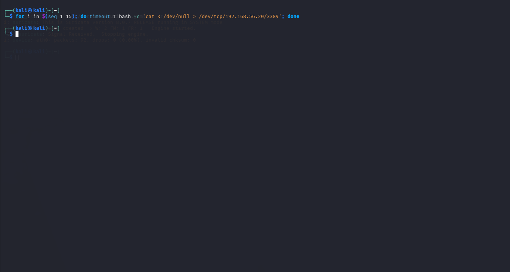
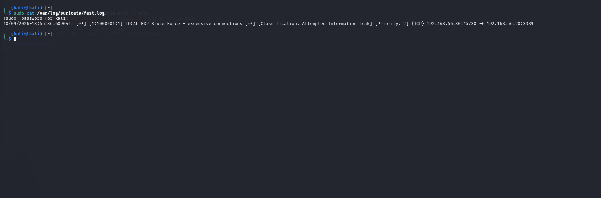

# Network Detection: RDP Brute Force (Suricata)

**MITRE ATT&CK:** T1110 (Brute Force)
**Tool:** Suricata 8.0.7 (network IDS, detect-only mode)
**Log source:** live traffic on the lab network, interface `eth0`

This is the network-layer view of the same RDP brute force caught in Detection 1. That one read the Windows host logs (Event 4625). This one reads the raw traffic on the wire.

## What Suricata is

Suricata is a network intrusion detection system (NIDS). It watches the traffic crossing a network interface and compares every packet against a set of rules. When traffic matches a rule, it writes an alert to `fast.log`. It runs the free ET Open ruleset (~53,000 signatures), plus any custom rules you add.

The difference from the Splunk detections: those read what the Windows machine recorded about itself. Suricata reads the traffic itself, so it sees the attack even where the host log wouldn't, and because RDP is encrypted, it sees the *pattern* of the attack but not the passwords.

## The rule

The rule counts connection attempts to the RDP port per source and fires when one source crosses a threshold:

```
alert tcp any any -> $HOME_NET 3389 (msg:"LOCAL RDP Brute Force - excessive connections"; flow:to_server; flags:S; threshold:type both, track by_src, count 10, seconds 60; classtype:attempted-recon; sid:1000001; rev:1;)
```



Read field by field:

- **`alert`**: alert me when traffic matches.
- **`tcp any any -> $HOME_NET 3389`**: watch TCP from any source, heading to the lab network on port 3389 (RDP).
- **`flow:to_server`**: count only traffic toward the victim (the attacker's attempts), not the replies.
- **`flags:S`**: count only SYN packets, the first packet of each new connection. So this counts *connection attempts*.
- **`threshold: count 10, seconds 60, track by_src`**: the threshold. Fire only when one source (`by_src`) makes 10+ attempts within 60 seconds. It separates one honest connection from a flood.
- **`sid:1000001`**: the rule's ID. Numbers over 1000000 are reserved for custom rules.

The classtype is `attempted-recon`, which prints as `Attempted Information Leak` at priority 2. Recon rather than a direct attack is the honest label here: at the network layer Suricata only sees the connection pattern, not the login attempts inside the encrypted RDP session, so from the wire a flood of connections reads as probing, not confirmed password guessing. That is the same point as "Suricata sees the pattern, not the passwords."

The rule looks at how the traffic behaves, not at any specific password, IP, or tool. It only asks one thing: is a single source making too many connections to the RDP port too quickly? Because that is the question, it catches the attack no matter what tool the attacker uses or what passwords they try. If the rule instead searched for a known attacker IP or a specific tool, the attacker could change either one and slip past. Watching the behaviour closes that gap.

## The attack

The rule detects the connection pattern a brute force makes on the wire: one source opening many connections to port 3389 in a short period. From Kali (192.168.56.30), a burst of 15 connections to the victim's RDP port generates exactly that pattern, enough to cross the threshold of 10.

```
for i in $(seq 1 15); do timeout 1 bash -c 'cat < /dev/null > /dev/tcp/192.168.56.20/3389'; done
```

With Suricata watching `eth0`, it processed the traffic (packets seen, zero dropped), confirming the sensor was live during the attack.




## The alert

The rule fired and wrote one line to `fast.log`:

```
[1:1000001:1] LOCAL RDP Brute Force - excessive connections [Classification: Attempted Information Leak] [Priority: 2] {TCP} 192.168.56.30:45730 -> 192.168.56.20:3389
```



- `1:1000001:1`: the signature ID, confirming it's the custom rule, not a downloaded one.
- `192.168.56.30 -> 192.168.56.20:3389`: attacker to victim on the RDP port.
- It fired only after the threshold was crossed: one connection stays silent, a burst trips it.

## False positives

The threshold is the main defence: one normal RDP connection stays under the limit, only a burst from one source fires. The same tuning idea as the host detection applies. If needed, raise the count or narrow the window, and exclude a known-good source (a monitoring host that legitimately opens many RDP connections) by its IP, rather than weakening the rule.

**Limitation:** this counts connections per source, so it catches one source hammering the port. A slow brute force spread over a long time, or spraying from many sources, would stay under the threshold.

## NCA ECC-2:2024 mapping

- **2-5 Networks Security Management**: a network intrusion detection system monitoring traffic is a network-layer security control, which the host-based detections do not cover.
- **2-12 Cybersecurity Event Logs and Monitoring Management**: Suricata continuously monitors network traffic and records alerts.
- **2-13 Cybersecurity Incident and Threat Management**: a fired alert is the start of triage and response.
